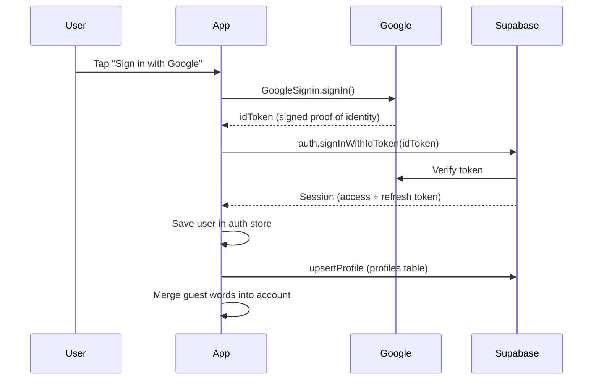
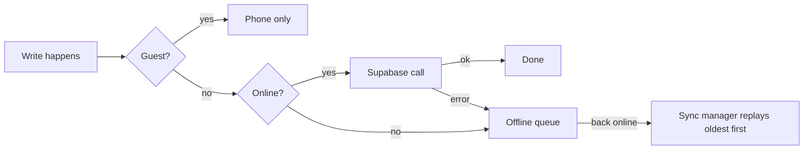

# How NepLearn Works

The whole app explained from its actual code: login, data, offline sync, AI, and the concepts behind each. Every section names the files to open.

## Contents

1. [The big picture](#1-the-big-picture)
2. [Login](#2-login)
3. [Navigation](#3-navigation)
4. [State: Zustand + persist](#4-state-zustand--persist)
5. [Offline-first writes](#5-offline-first-writes)
6. [Reading from the cloud](#6-reading-from-the-cloud)
7. [Database & RLS](#7-database--rls)
8. [XP & streaks](#8-xp--streaks)
9. [Spaced repetition](#9-spaced-repetition)
10. [AI](#10-ai)
11. [Speech](#11-speech)
12. [Notifications](#12-notifications)
13. [Config & secrets](#13-config--secrets)
14. [Styling](#14-styling)
15. [Build & release](#15-build--release)
16. [Questions a senior might ask](#16-questions-a-senior-might-ask)
17. [Reading order](#17-reading-order)

---

## 1. The big picture

NepLearn is a **React Native** app built with **Expo**. You write TypeScript once and it runs on Android, iOS and web.

```
┌────────────────── PHONE ──────────────────┐        ┌──────── CLOUD ────────┐
│  Screens (app/*.tsx)                      │        │  Supabase             │
│     │ read/write                          │        │   - Postgres database │
│     ▼                                     │        │   - Auth (logins)     │
│  Stores (Zustand) ◄─► AsyncStorage        │ ─────► │   - Edge Function     │
│     │                 (phone storage)     │        │       ai-chat ──► Groq│
│     ▼                                     │        └───────────────────────┘
│  Services (src/services/*.ts)             │
│   db, ai, tts, network, sync, notifs      │ ─────► Google (sign-in, TTS)
└───────────────────────────────────────────┘
```

> **Core idea: local-first.** Everything saves on the phone first, so the app works offline and in guest mode. The cloud is a backup and sync layer for signed-in users.

---

## 2. Login

Files: `app/signin.tsx`, `src/stores/auth.ts`, `src/services/supabase.ts`

### When you tap "Sign in with Google"



1. `GoogleSignin.signIn()` opens Google's account picker.
2. Google returns an **idToken**: a signed token saying "this is you@gmail.com".
3. The app sends it to `supabase.auth.signInWithIdToken`.
4. Supabase checks it with Google, creates or finds the user, and returns a **session**.
5. The app saves `{ id, name, email, photo }` in the auth store.
6. `upsertProfile()` writes name, email and photo to the `profiles` table.
7. Words learned as a guest are copied into the account.
8. `router.replace('/')` goes home.

| Term | Meaning |
|---|---|
| **idToken** | A JWT (signed text token) from Google proving who you are. Only Google can create it, so Supabase can trust it. |
| **Session** | What Supabase gives back: an **access token** (expires in about an hour) and a **refresh token** (gets new access tokens). The SDK stores it in AsyncStorage and refreshes it automatically (`autoRefreshToken: true`). |
| **webClientId** | Google issues the idToken for a specific audience. Supabase is configured with your web client ID, so the token must be issued for it or Supabase rejects it. Most common cause of Google sign-in bugs. |
| **Play Services** | Android Google sign-in needs Google Play Services, so `hasPlayServices()` checks first. |

### Opening the app later

`useAuthStore.initialize()` runs once from `app/_layout.tsx`:

1. `supabase.auth.getSession()` reads the saved session. If one exists, you're logged in with no tap.
2. `onAuthStateChange(...)` subscribes to token refreshes and sign-outs, and updates the store.

### Sign out

`clearUser()` calls `supabase.auth.signOut()`, empties the user, and deletes that user's pending offline writes so the next person on the phone can't sync into the account.

### Guest mode

"Continue without signing in" only marks onboarding done. Guests use the ID `GUEST_ID = '__guest__'`, and every cloud function starts with:

```ts
if (userId.startsWith('__guest__')) return;   // guests never touch the cloud
```

---

## 3. Navigation

Library: `expo-router` · Files: `app/*.tsx`, `app/_layout.tsx`

- **File-based routing:** each file in `app/` is a screen and its name is its URL. `app/settings.tsx` → `/settings`; `app/quiz/[category].tsx` → `/quiz/food` (brackets mean a dynamic parameter).
- **`_layout.tsx`** wraps every screen: providers, service startup, and which screens are allowed.
- **Stack:** a pile of cards. `router.push('/x')` adds one on top and back removes it. `router.replace('/x')` swaps the top card, so back won't return to it.
- **`Stack.Protected guard={...}`:** screens inside are reachable only when the guard is true. This keeps onboarding and home apart and fixed the home-screen flash.
- **Params:** `useGlobalSearchParams()` gives you `category` on `/quiz/food`.

---

## 4. State: Zustand + persist

Files: `src/stores/*.ts`, `src/data/vocab.ts`

**State** is data the UI shows that can change. **Zustand** keeps it in global stores any screen can read.

```ts
const learned = useVocabStore(s => s.getLearned(uid));   // in a screen: re-renders on change
useVocabStore.getState().learnWord(uid, 5);               // outside React: read/write directly
```

The **persist** middleware saves each store to **AsyncStorage**, the phone's key-value storage (like `localStorage` on the web).

| Store | Storage key | Holds |
|---|---|---|
| `useVocabStore` | `nepali-vocab` | Learned words, local XP and streak, onboarding done, name, goal |
| `useSrsStore` | `nepali-srs` | Spaced-repetition schedule per word |
| `useAuthStore` | not persisted | Current user and session (Supabase saves the session itself) |
| `useAiQuotaStore` | `nepali-ai-quota` | AI usage count, the user's own key and provider |
| `useDailyXpStore` | `nepali-daily-xp` | Today's XP and day-by-day history for the heatmap |
| settings, stats, mistakes, chats, notifPrompt | various | What their names say |

- **Hydration:** on startup, persist loads saved data asynchronously. For a moment the store holds defaults. That caused the home-screen flash, so `_layout.tsx` now waits for `hasHydrated()`.
- **Per-user data:** data is keyed by user, e.g. `learnedByUser: { "__guest__": [1,5], "uuid-abc": [1,2,3] }`. Guest and account data sit side by side, which is how sign-in can merge them.

---

## 5. Offline-first writes

Files: `src/services/db.ts`, `offlineQueue.ts`, `syncManager.ts`, `network.ts`

Every cloud write in `db.ts` follows one pattern:

```ts
export async function syncLearnWord(userId, wordId) {
  if (guest) return;                                  // 1. guests: local only
  if (online) {
    const { error } = await supabase.from('user_learned_words').upsert(...);
    if (!error) return;                               // 2. online + success: done
  }
  await enqueue({ type: 'LEARN_WORD', payload });     // 3. offline or failed: queue it
}
```



| Term | Meaning |
|---|---|
| **Queue** | A list of pending operations saved in AsyncStorage under `nepali-offline-queue`. |
| **Dedupe key** | Some operations replace older queued copies, e.g. three profile edits offline keep only the last. |
| **When it syncs** | When the internet returns, when the app comes to the foreground, and at startup. |
| **Success** | Removed from the queue. |
| **Permanent error** | Bad data or a database rule refused it (Postgres codes 22xxx, 23xxx, 42xxx). Dropped, since retrying won't help. |
| **Temporary error** | A network blip. Retried up to 3 times, then dropped. |
| **Network detection** | `expo-network` reports changes. On "offline" the app double-checks by pinging Google, because phones sometimes misreport. Others subscribe via `networkManager.addListener(...)` (the listener pattern). |

---

## 6. Reading from the cloud

When a signed-in user opens the app, `_layout.tsx` runs `syncFromCloud` for learned words and SRS once animations finish.

| Data | Conflict rule |
|---|---|
| Learned words | Cloud is the source of truth, so un-learning on one phone removes it on another. Changes still in the offline queue win. A failed fetch keeps local data instead of wiping it. |
| SRS | Most recent review wins (`last_reviewed_at`). |
| Streak | Most recent activity date wins; longest streak is the max of both. |

This is **conflict resolution**: deciding which copy wins when the phone and the cloud disagree.

---

## 7. Database & RLS

Files: `supabase/migrations/*.sql`

Supabase is hosted **Postgres** plus auth, with an API generated for every table. The app uses the **Supabase JS SDK**:

```ts
supabase.from('user_xp').insert({ user_id, xp_amount: 20, source: 'quiz' })
supabase.from('user_learned_words').select('word_id').eq('user_id', id)
supabase.rpc('get_total_xp', { p_user_id: id })     // call a SQL function
```

**Tables:** `profiles`, `user_learned_words`, `user_xp`, `user_streaks`, `user_word_srs`, `journal_entries`, `ai_conversations`, `ai_chat_history`, `ai_usage`.

### Row Level Security, the key security idea

The anon key ships inside the app, so anyone could call the database with it. RLS policies are rules inside Postgres:

```sql
create policy "Users can read own conversations" on ai_conversations
  for select using (auth.uid() = user_id);
```

`auth.uid()` is the logged-in user from their token, so a user can only touch their own rows. **The anon key is safe to ship only because RLS is on.** The Groq key had no such protection, which is why it moved to the server.

| Term | Meaning |
|---|---|
| **RPC** | A SQL function called from the app. `get_total_xp` sums on the server instead of downloading every row. |
| **security definer** | The function runs with the owner's permissions. That's how the leaderboard shows others' XP without exposing their rows. |
| **Upsert** | Insert, or update if it exists. `onConflict: 'user_id,word_id'` defines "exists". |

---

## 8. XP & streaks

Files: `src/services/xp.ts`, `src/services/streak.ts`

| Activity | XP |
|---|---|
| Lesson, per correct answer | +20 |
| Quiz, per correct answer | +15 |
| Journal save | +25 |
| Echo practice complete | +30 |

`awardXp(userId, amount, source)`:

1. Adds to today's XP (daily goal and heatmap).
2. Guest: adds to local XP. Signed in: inserts a row into `user_xp`, or queues it.
3. Calls `recordActivity()` to update the streak.

Streak: active yesterday means +1; a gap resets to 1. Computed locally, pushed to `user_streaks`, merged.

XP is stored as **one row per award** with a `source`, not one total. That keeps history for the heatmap and per-source stats; the total is a SUM.

---

## 9. Spaced repetition

File: `src/stores/srs.ts`

Review a word just before you'd forget it, using the **Leitner box** system:

| Box | Review again in |
|---|---|
| 1 | 1 day |
| 2 | 3 days |
| 3 | 7 days |
| 4 | 14 days |
| 5 | 30 days |

- Correct: up one box, seen less often.
- Wrong: back to box 1, and recorded in the mistakes store.
- `getDueWords()`: words past their `dueAt`. This is the Review screen.
- `getStrength()`: a 0–1 score that decays when a review is overdue.

---

## 10. AI

Files: `src/services/ai.ts`, `supabase/functions/ai-chat/index.ts`, `src/stores/aiQuota.ts`

> **One-line answer:** An API fetch, not an AI SDK. Plain `fetch` to Groq's OpenAI-compatible `/chat/completions` endpoint, called through a Supabase Edge Function that holds the key, checks sign-in and enforces 50 requests per user per day. Users with their own key in Settings call their provider directly.

```
App screen (e.g. Aama chat)
   │  sendMessage("How do I say water?")
   ▼
src/services/ai.ts
   │  Does the user have their own key?
   ├── YES → fetch() straight to their provider
   └── NO  → supabase.functions.invoke('ai-chat')
                 ▼
        ai-chat Edge Function (Supabase's servers)
          1. Check the login token
          2. Over 50 today? Return 429
          3. fetch() to api.groq.com with the secret key
          4. Send the reply back
```

### What gets sent

```
POST https://api.groq.com/openai/v1/chat/completions
Authorization: Bearer gsk_xxx

{
  "model": "qwen/qwen3.8-27b",
  "messages": [
    { "role": "system", "content": "You are Aama, a warm, patient Nepali tutor..." },
    { "role": "user",   "content": "How do I say water?" }
  ]
}
```

The answer is read from `data.choices[0].message.content`. The same format works for Groq, OpenAI and Gemini; only the URL and key change.

| Feature | Function | What it does |
|---|---|---|
| Aama chat, Roleplay | `sendMessage` | Chat history plus the Aama system prompt |
| Journal | `getJournalFeedback` | JSON back: corrected text, romanised text, explanation |
| Practice Mistakes | `generateMistakeQuiz` | JSON quiz questions about missed words |
| Photo Vocab | `identifyObjects` | Photo as base64; AI names objects in Nepali |

| Term | Meaning |
|---|---|
| **SDK** | A library that wraps an API, e.g. `openai.chat.completions.create(...)`. Not used for AI here. |
| **API fetch** | Building the HTTP request yourself with `fetch()`. What this app does. |
| **System prompt** | Hidden instructions that set the AI's personality: Aama. |
| **JSON mode** | `response_format: { type: 'json_object' }` forces a JSON reply the code can parse. |
| **Edge Function** | Small server code on Supabase. Keeps the secret key off phones. |
| **One catch** | `supabase.functions.invoke` is the Supabase SDK calling our own function. The AI call itself is a raw `fetch`. |

---

## 11. Speech

Files: `src/services/tts.ts`, speak-check and echo-practice screens

- **Text-to-speech:** first tries the phone's Nepali voice (`ne-NP`) via `expo-speech`. If none, plays a Google Translate audio URL with `expo-av`. That endpoint is unofficial and Google could block it.
- **Speech recognition:** `@dev-amirzubair/react-native-voice` with the microphone, hence `RECORD_AUDIO` in `app.config.js`.

---

## 12. Notifications

File: `src/services/notifications.ts` · Library: `expo-notifications`

**Local notifications**, scheduled on the phone, with no push server.

- **Daily reminder:** at the user's chosen time; text changes with the streak.
- **Word of the day:** day-of-year modulo word count, so everyone gets the same word on a given day.
- Re-scheduled whenever the app comes to the foreground so the streak text stays current.
- The permission prompt appears about 2.5 minutes after onboarding, not at first launch.

---

## 13. Config & secrets

```
.env  ──►  app.config.js (process.env → expo.extra)  ──►  src/config.ts (Constants.expoConfig.extra)
```

- `.env` lives on your laptop and is git-ignored.
- `app.config.js` copies values into `extra` at **build time**.
- **Anything in `extra` ships inside the app and is public.** Fine for the Supabase URL, the anon key (protected by RLS) and Google client IDs. Not fine for an AI key.
- **Dev vs production:** `isDev` switches the package name (`com.neplearn.app.dev`), app name and Google client IDs, so both installs can coexist.

---

## 14. Styling

**NativeWind** brings Tailwind classes to React Native: `className="bg-brand py-4 rounded-full"`. Custom colours `cream`, `brand`, `ink` and `line` are in `tailwind.config.js`.

---

## 15. Build & release

| Term | Meaning |
|---|---|
| **EAS Build** | `eas build` compiles in Expo's cloud and produces an `.aab` for the Play Store. Profiles are in `eas.json`. |
| **Dev client** | `expo-dev-client`: your own debug build that loads JavaScript live from your laptop. |
| **New Architecture** | `newArchEnabled: true` turns on React Native's newer, faster internals. |

---

## 16. Questions a senior might ask

| Question | Answer |
|---|---|
| How is AI used: SDK or API fetch? | API fetch to an OpenAI-compatible endpoint, through a Supabase Edge Function proxy that holds the key and enforces a daily limit. |
| How do you handle auth? | Native Google Sign-In gets an idToken; `supabase.auth.signInWithIdToken` exchanges it for a Supabase session that's stored and auto-refreshed. |
| How is data secured? | Postgres RLS: users can only touch their own rows. Secrets live only on the server. |
| What happens offline? | Writes go to a persistent queue in AsyncStorage, replayed in order when back online, with retries and permanent-error detection. |
| State management? | Zustand stores persisted to AsyncStorage, with data kept per user. |
| How are sync conflicts resolved? | Learned words: cloud wins, but pending local changes win over it. SRS: latest review wins. Streak: latest activity wins, max of longest. |
| Known weak spots? | TTS fallback uses an unofficial Google endpoint. Dates use UTC, so a streak day ends at a different local time per user. The custom `SplashScreen.tsx` component isn't used. |

---

## 17. Reading order

About an hour. Each file builds on the last.

1. `app/_layout.tsx`: app startup
2. `app/signin.tsx`, then `src/stores/auth.ts`: login
3. `src/data/vocab.ts`, top 170 lines: a store
4. `src/services/db.ts`, first 66 lines: the online-or-queue pattern
5. `src/services/syncManager.ts`: the queue replay
6. `src/services/ai.ts`: AI
