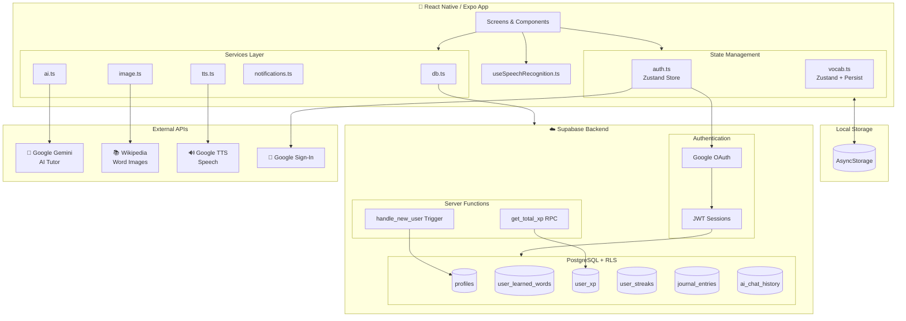
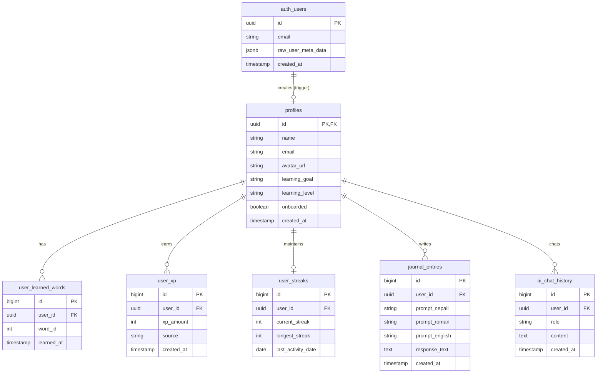
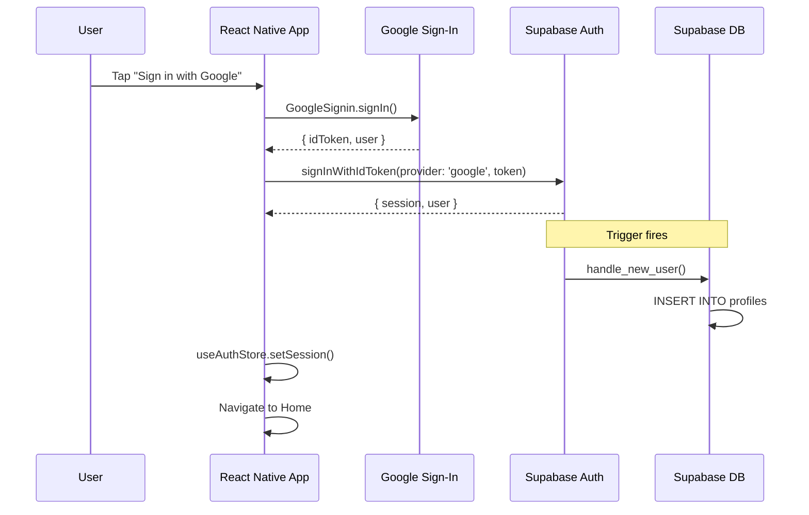
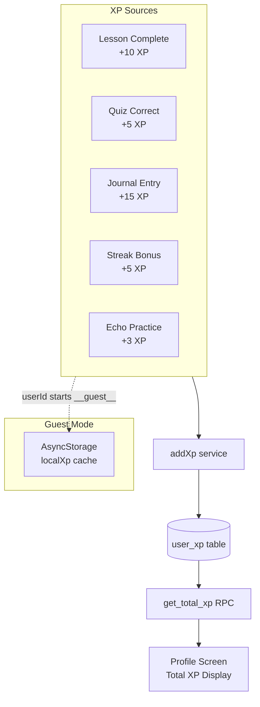
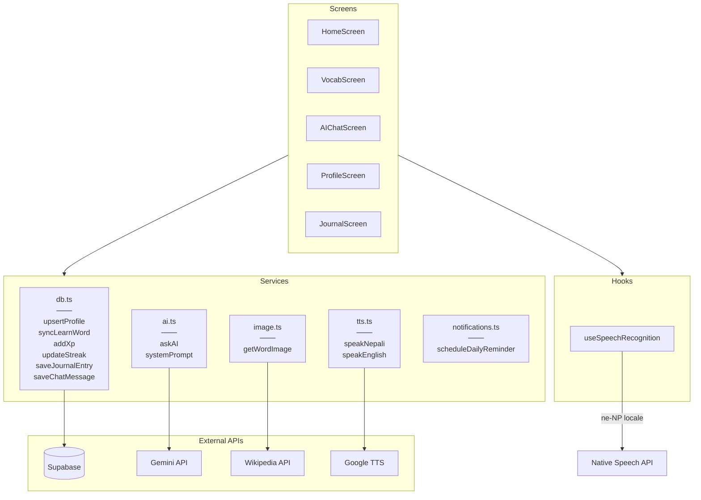
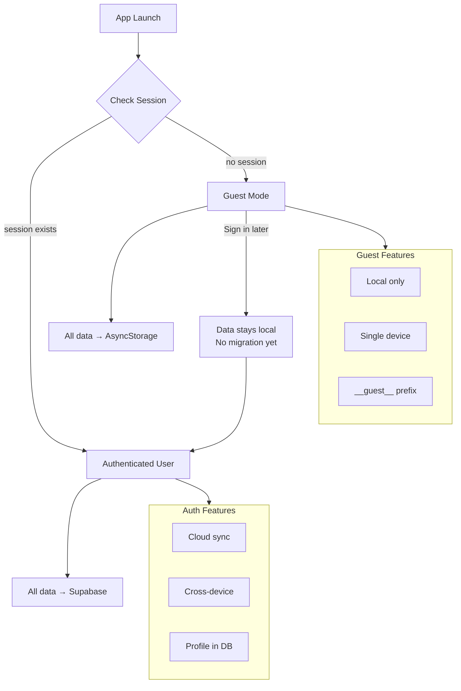
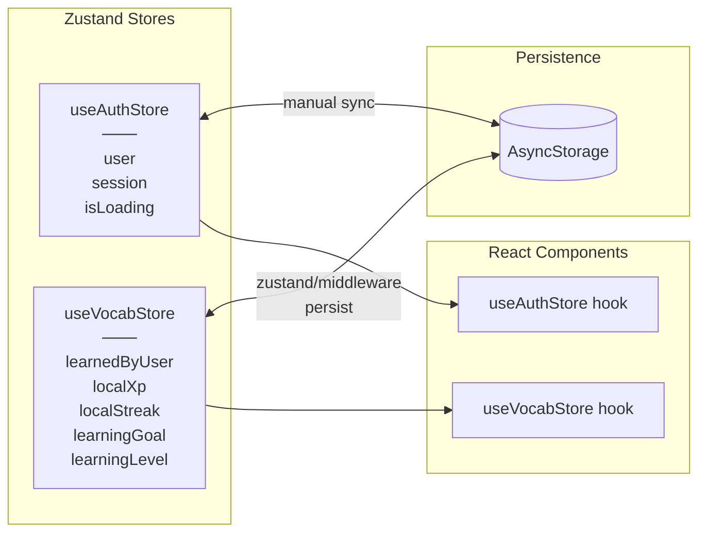

# NepLearn Mobile - Architecture Diagrams

## 1. Backend Architecture Overview



---

## 2. ER Diagram (Database Schema)



---

## 3. Authentication Flow



---

## 4. Data Sync Flow (Vocabulary)

```mermaid
flowchart LR
    subgraph Local["Local (Zustand + AsyncStorage)"]
        LS[learnedByUser<br/>Record‹userId, wordId[]›]
    end

    subgraph Cloud["Supabase"]
        ULW[(user_learned_words)]
    end

    LS -->|"learnWord()"| ULW
    LS -->|"unlearnWord()"| ULW
    ULW -->|"syncFromCloud()"| LS

    subgraph Merge["Conflict Resolution"]
        M[Set Union<br/>local ∪ cloud]
    end

    LS --> M
    ULW --> M
    M --> LS
```

---

## 5. XP System Flow



---

## 6. Service Layer Architecture



---

## 7. Guest vs Authenticated User Flow



---

## 8. State Management Architecture



---

## Summary Table

| Diagram | Shows |
|---------|-------|
| **Backend Overview** | Full system architecture w/ all connections |
| **ER Diagram** | 6 tables, relationships, RLS boundaries |
| **Auth Flow** | Google OAuth → Supabase → auto-profile trigger |
| **Data Sync** | Bidirectional sync w/ Set union merge |
| **XP System** | 5 sources → aggregation → display |
| **Services** | Service layer → external API mapping |
| **Guest/Auth** | Two data paths, no migration |
| **State** | Zustand + AsyncStorage persistence |

---

## Key Files Reference

| File | Purpose |
|------|---------|
| `src/config.ts` | API keys & URLs |
| `src/services/db.ts` | Database operations |
| `src/services/ai.ts` | Gemini AI service |
| `src/services/supabase.ts` | Supabase client |
| `src/stores/auth.ts` | Auth state (Zustand) |
| `src/data/vocab.ts` | Vocabulary state |
| `supabase/migrations/001_schema.sql` | DB schema |
